# 🧪 Panduan Install GROMACS di Ubuntu 24.04 LTS

Dokumen ini menjelaskan langkah-langkah untuk menginstal **GROMACS 2025.0** di Ubuntu 24.04, termasuk pengaturan `cmake` terbaru dan proses build manual.

---

## 🛠️ 1. (Opsional) Update Your Sistem

```bash
sudo apt update && sudo apt upgrade -y
```


---

## 📦 2. Latest Version of C and ++ Compilers
The latest version of the C and C++ compilers are typically included by default with Ubuntu. If you want to double check that GNU C++ compiler is installed, you can run the command:


```bash
sudo apt-get install g++
```
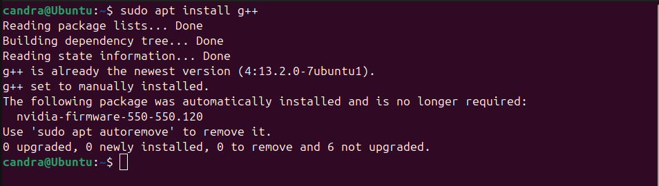

---

## 🧰 3. Install Build Essentials

```bash
sudo apt install build-essential
```

---

## ⚙️ 4. Install latest version cmake, version 3.25 is better
 this step is important. This step give error for most of case, because by default ubuntu come with cmake version 3.16. so we have to firs remove the older version of cmake 3.16 and then install cmake 3.25 as follows

### a. Hapus versi lama cmake:

```bash
sudo apt remove cmake
```

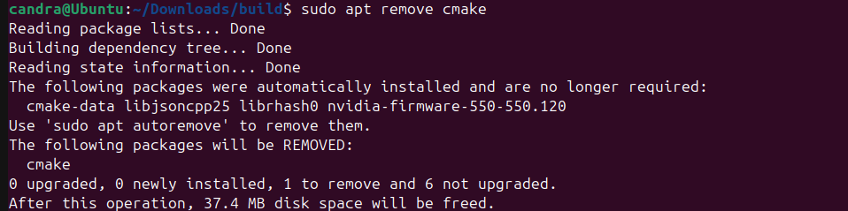

---

### b. To install cmake 3.25 first we need snap installed

```bash
sudo apt install snap
```

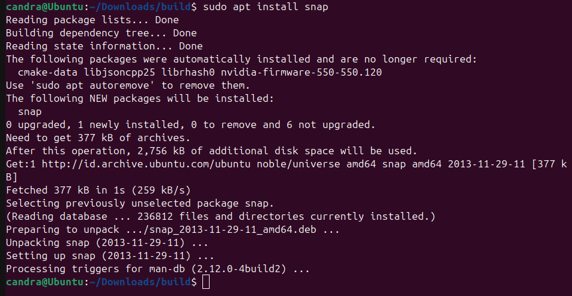

---

### c. And then install cmake. This command will give security warning and to add –classic. The classic flag is used with the snap install command to install a classic snap, which is a snap that has full access to the system and can run without confinement. Installing a classic snap can potentially pose a security risk, as it can give the snap access to sensitive system resources and data

```bash
sudo snap install cmake --classic
```
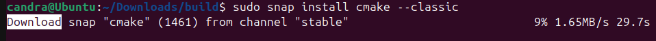

---

## 📥 5. Download GROMACS

Download Gromacs new version. Official release :  
🔗 https://manual.gromacs.org/documentation/

## 📁 6. Go to the download folder and unzip “gromacs-2025.0.tar.gz

```bash
tar xvf gromacs-2025.0.tar.gz
```
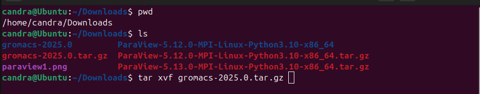

---
## 📁 7. Prepare directory for Build

Go to unzip folder, make a directory named “build” and go to the build folder

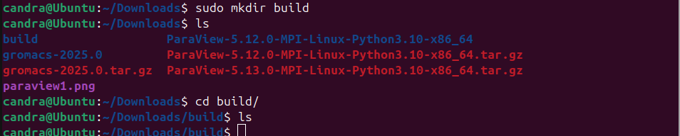

## ⚙️ 8. Generate Build File dengan CMake

```bash
sudo cmake .. -DGMX_BUILD_OWN_FFTW=ON -DREGRESSIONTEST_DOWNLOAD=ON
```
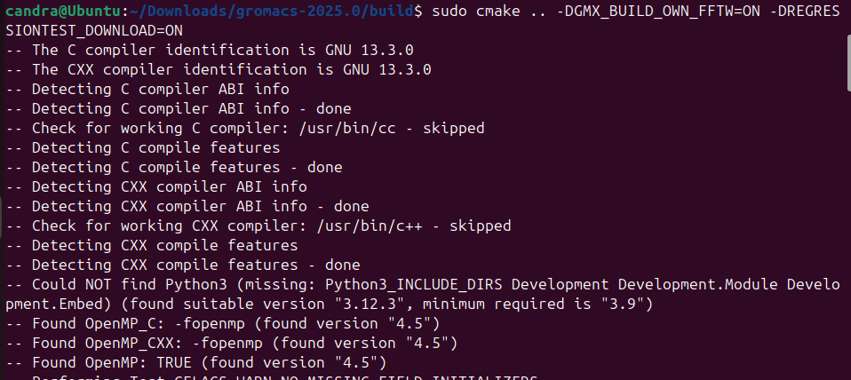


## 🧱 9. Kompilasi GROMACS

```bash
sudo make
```
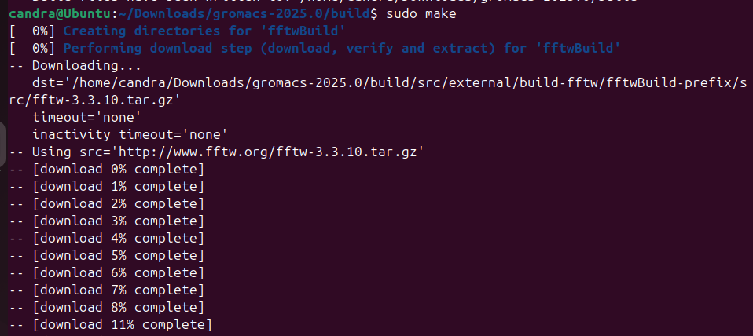

---

## ✅ 10.	After the make compilation is done, type “make check” followed by enter. This process will also take time to complate, nearly 20-30 minute

```bash
sudo make check
```
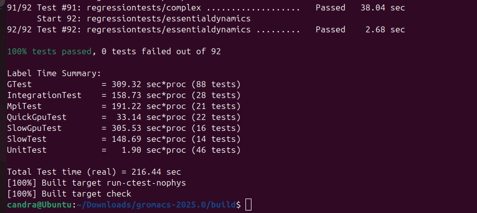
> Akan memakan waktu ±20–30 menit.

---

## 📦 11. Instalasi Final

```bash
sudo make install source /usr/local/gromacs/bin/GMXRC
```
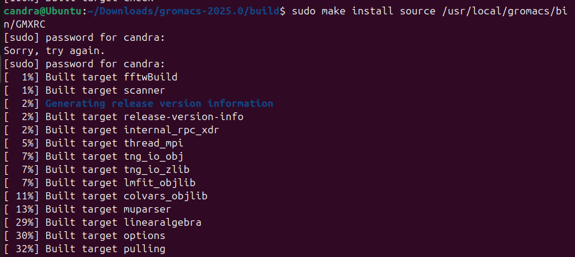

---

## 🧪 12.	Install gromacs

```bash
sudo apt install gromacs
```


---

## ▶️ 13.	Which will complate the Gromacs-2025 installation in ubuntu linux. The “gmx” command in the terminal should now give output like these:

```bash
gmx
```
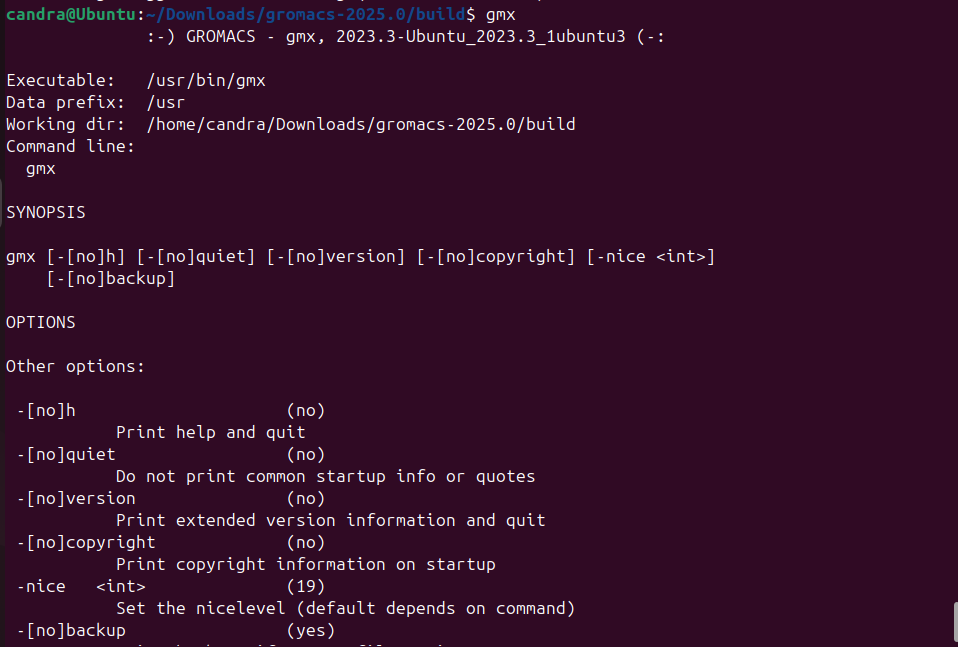
Jika berhasil, akan muncul tampilan seperti versi GROMACS, opsi command-line, dll.

---

## 🔗 Referensi

Tutorial ini disusun berdasarkan sumber berikut:  
https://www.google.com/search?q=how+to+install+gromacs+on+ubuntu+24.04
