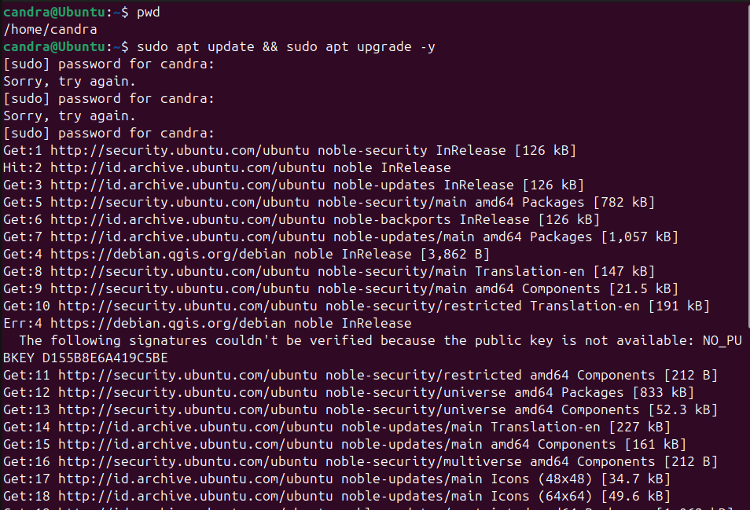

# 🧪 Panduan Install GROMACS di Ubuntu 24.04 LTS

Dokumen ini menjelaskan langkah-langkah untuk menginstal **GROMACS 2025.0** di Ubuntu 24.04, termasuk pengaturan `cmake` terbaru dan proses build manual.

---

## 🛠️ 1. (Opsional) Update Sistem

```bash
sudo apt update && sudo apt upgrade -y
```



---

## 📦 2. Cek dan Install Compiler C++

```bash
sudo apt-get install g++
```

---

## 🧰 3. Install Build Essentials

```bash
sudo apt install build-essential
```

---

## ⚙️ 4. Install `cmake` Versi 3.25 (Pengganti cmake default 3.16)

### a. Hapus versi lama cmake:

```bash
sudo apt remove cmake
```

### b. Install Snap (jika belum ada):

```bash
sudo apt install snap
```

### c. Install cmake versi 3.25 via snap:

```bash
sudo snap install cmake --classic
```

> ❗ `--classic` memberi akses penuh ke sistem — gunakan dengan hati-hati.

---

## 📥 5. Unduh GROMACS

Unduh versi terbaru dari:  
🔗 https://manual.gromacs.org/documentation/

Misalnya file `gromacs-2025.0.tar.gz` berada di folder **Downloads**, jalankan:

```bash
tar xvf gromacs-2025.0.tar.gz
```

---

## 📁 6. Persiapan Build Directory

Masuk ke folder hasil ekstrak:

```bash
cd gromacs-2025.0
mkdir build
cd build
```

---

## ⚙️ 7. Generate Build File dengan CMake

```bash
sudo cmake .. -DGMX_BUILD_OWN_FFTW=ON -DREGRESSIONTEST_DOWNLOAD=ON
```

---

## 🧱 8. Kompilasi GROMACS

```bash
sudo make
```

> Proses ini memerlukan waktu beberapa menit.

---

## ✅ 9. Verifikasi Build

```bash
sudo make check
```

> Akan memakan waktu ±20–30 menit.

---

## 📦 10. Instalasi Final

```bash
sudo make install
source /usr/local/gromacs/bin/GMXRC
```

---

## 🧪 11. Alternatif: Install langsung via APT

```bash
sudo apt install gromacs
```

---

## ▶️ 12. Jalankan GROMACS

Coba perintah berikut untuk memverifikasi instalasi:

```bash
gmx
```

Jika berhasil, akan muncul tampilan seperti versi GROMACS, opsi command-line, dll.

---

## 🔗 Referensi

Tutorial ini disusun berdasarkan sumber berikut:  
https://www.google.com/search?q=how+to+install+gromacs+on+ubuntu+24.04
