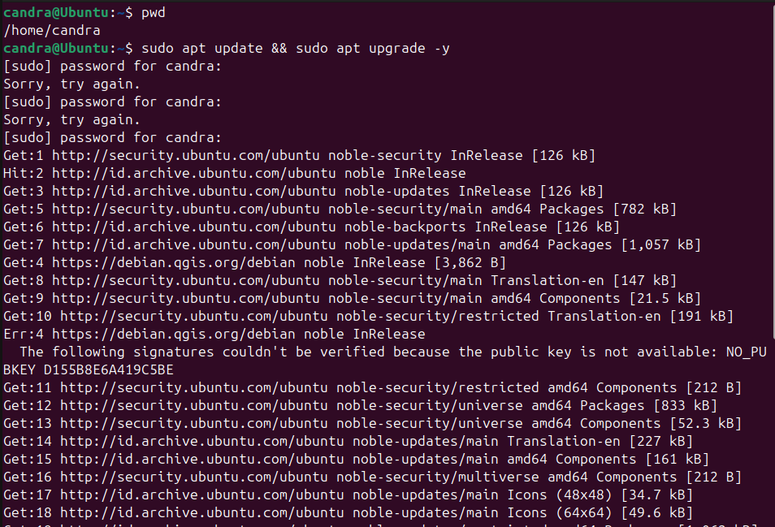

# 🧮 Panduan Install GNU Octave di Ubuntu 24.04 LTS

Panduan ini menjelaskan langkah-langkah untuk menginstal GNU Octave versi terbaru di Ubuntu 24.04 menggunakan PPA (Personal Package Archive).

---

## 🛠️ 1. (Opsional) Update Sistem

Sebelum menginstal software baru, sebaiknya update sistem terlebih dahulu:

```bash
sudo apt update && sudo apt upgrade -y
```


---

## ➕ 2. Tambahkan Repository Octave

Versi terbaru Octave tidak selalu tersedia di repository bawaan Ubuntu. Tambahkan PPA resmi berikut:

```bash
sudo add-apt-repository ppa:ubuntuhandbook1/octave
```


---

## 🔄 3. Perbarui Daftar Paket

Setelah menambahkan repository, perbarui daftar paket:

```bash
sudo apt update
```


---

## 📦 4. Install GNU Octave

Jalankan perintah berikut untuk menginstal Octave:

```bash
sudo apt install octave -y
```


---

## ▶️ 5. Jalankan Octave

Setelah instalasi selesai, kamu bisa menjalankan Octave dengan mengetik:

```bash
octave
```


---

## 🔗 Referensi

Sumber panduan ini berasal dari:  
https://idolinux.com/install-octave-ubuntu/

---

## 📁 Catatan Gambar

Untuk setiap langkah di atas, pastikan screenshot disimpan dalam folder images/ dan diberi nama sebagai berikut:

| Langkah                        | Nama Gambar              |
|-------------------------------|--------------------------|
| Update sistem                 | update-system.png        |
| Tambahkan repository Octave   | add-ppa-octave.png       |
| Update daftar paket           | update-package.png       |
| Install octave                | install-octave.png       |
| Menjalankan Octave            | run-octave.png           |
