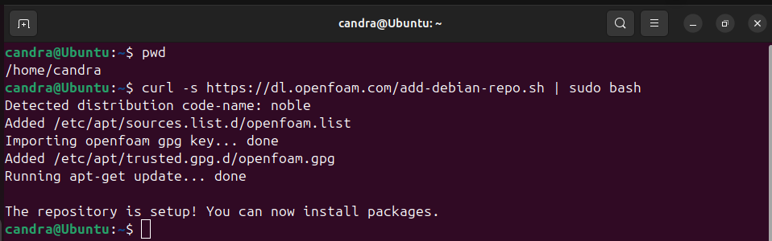
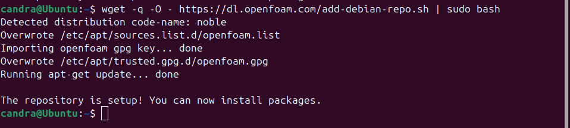
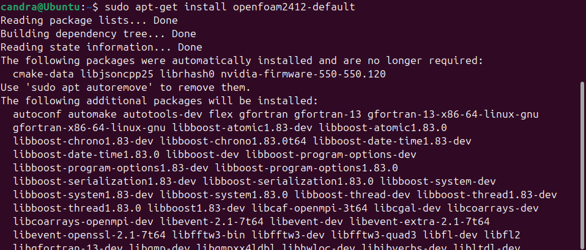
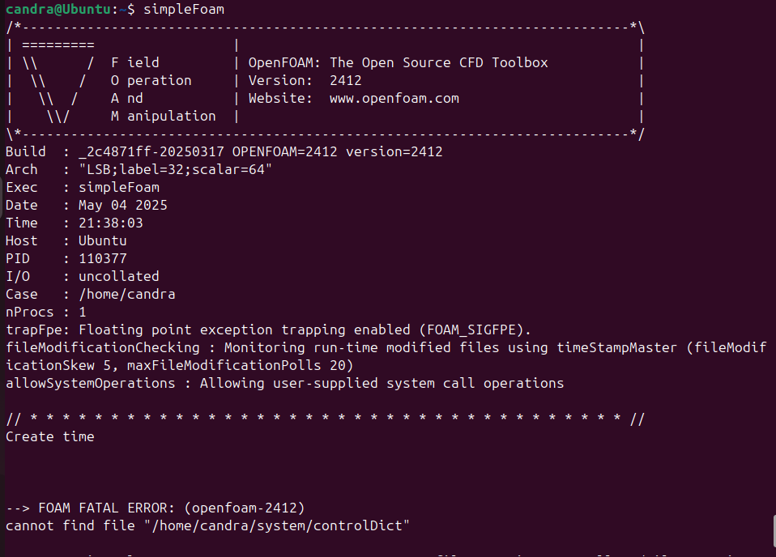

# 🌀 Panduan Install OpenFOAM di Ubuntu 24.04 LTS

Panduan ini menjelaskan cara instalasi OpenFOAM versi 2412 di Ubuntu 24.04 menggunakan repository resmi dari OpenFOAM.

---

## 🔑 1. Tambahkan Repository dan Signing Key
```bash
Gunakan salah satu dari dua perintah berikut:

curl -s https://dl.openfoam.com/add-debian-repo.sh | sudo bash
```
atau:
```bash
wget -q -O - https://dl.openfoam.com/add-debian-repo.sh | sudo bash
```



---

## 📦 2. Install OpenFOAM

Setelah repository ditambahkan, langsung instalasi paket OpenFOAM:
```bash
sudo apt-get install openfoam2412-default
```


---

## ⚙️ 3. Edit .bashrc dan Tambahkan Environment Variable

Edit file .bashrc kamu:
```bash
gedit ~/.bashrc
```
Tambahkan baris berikut di akhir file:

. /usr/lib/openfoam/openfoam2412/etc/bashrc

Lalu jalankan:
```bash
. /usr/lib/openfoam/openfoam2412/etc/bashrc
```


---

## ▶️ 4. Jalankan OpenFOAM (contoh: simpleFoam)

Untuk menjalankan salah satu solver OpenFOAM:
```bash
simpleFoam
```


---

## 🔗 Referensi

Dokumentasi resmi OpenFOAM:  
https://develop.openfoam.com/Development/openfoam/-/wikis/precompiled/debian
