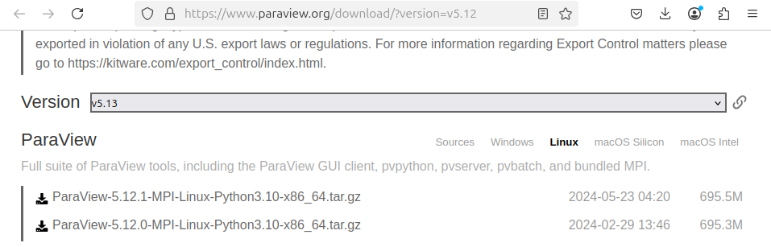
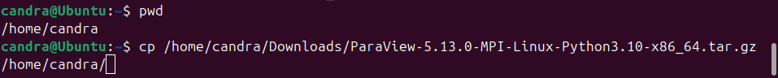
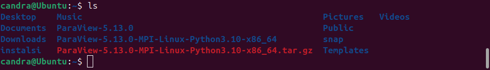
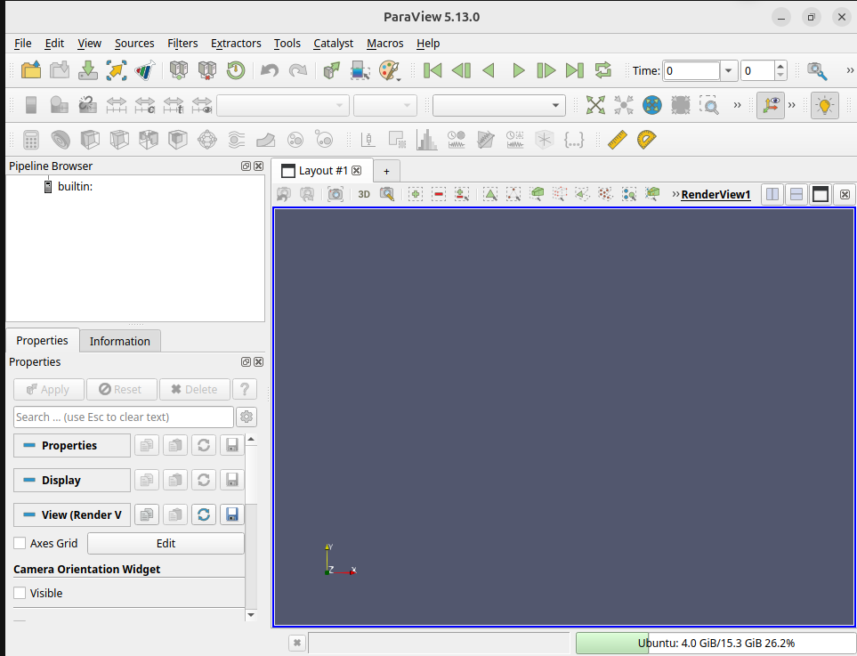
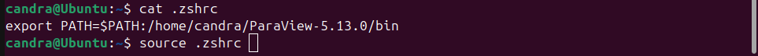
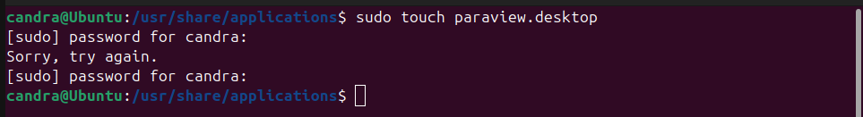
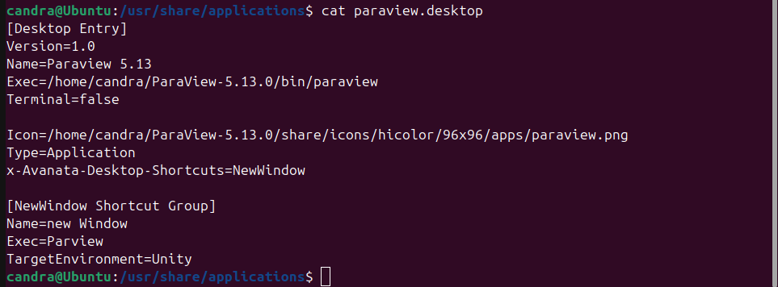

# 🖼️ Panduan Install ParaView 5.13 di Ubuntu 24.04 LTS

Panduan ini menjelaskan langkah-langkah menginstal dan menjalankan ParaView versi 5.13.0 di Ubuntu 24.04.

---

## 🔗 1. Unduh ParaView dari Situs Resmi

Kunjungi:

https://www.paraview.org/download/

Pilih versi ParaView 5.13.0 sesuai sistem operasi kamu.



---

## 📥 2. Simpan File di Direktori Home

Misal file hasil unduhan ada di folder Downloads, salin ke direktori home:
```bash
cp /home/user/Downloads/NamaFile.tar.gz /home/user/
```


---

## 📂 3. Ekstrak File

Gunakan perintah berikut untuk mengekstrak file:
```bash
tar -xzvf NamaFile.tar.gz
```



---

## ▶️ 4. Jalankan Aplikasi

Masuk ke direktori hasil ekstrak dan jalankan:
```bash
cd ParaView-5.13.0/bin/
./paraview
```



---

## 🛠️ 5. Tambahkan ke PATH

Agar ParaView bisa dijalankan dari terminal mana pun:

1. Edit (atau buat) file .zshrc di direktori home:
```bash
   nano ~/.zshrc
```
2. Tambahkan baris:
```bash
   export PATH="$PATH:/home/username/ParaView-5.13.0/bin"
```
3. Simpan dan keluar.

4. Jalankan:
```bash
   source ~/.zshrc
```


---

## 🧷 6. Buat Launcher Icon

### a. Buat file .desktop
```bash

sudo touch /usr/share/applications/paraview.desktop
```


### b. Edit file tersebut:
```bash

sudo nano /usr/share/applications/paraview.desktop
```


### c. Isi kontennya seperti ini:
```bash
[Desktop Entry]
Version=1.0
Name=Paraview 5.13
Exec=/home/username/ParaView-5.13.0/bin/paraview
Terminal=false
Icon=/home/username/ParaView-5.13.0/share/icons/hicolor/96x96/apps/paraview.png
Type=Application
X-Ayatana-Desktop-Shortcuts=NewWindow

[NewWindow Shortcut Group]
Name=New Window
Exec=paraview
TargetEnvironment=Unity
```
---

Setelah itu, icon launcher ParaView akan muncul di menu aplikasi Ubuntu.


---

## 🔗 Sumber:
https://www.paraview.org/download/
