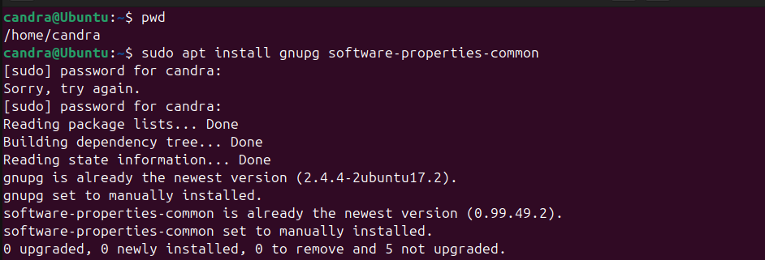
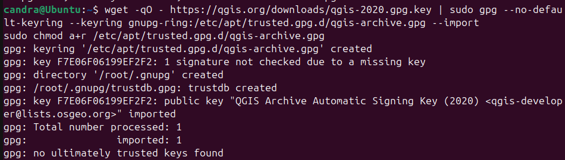
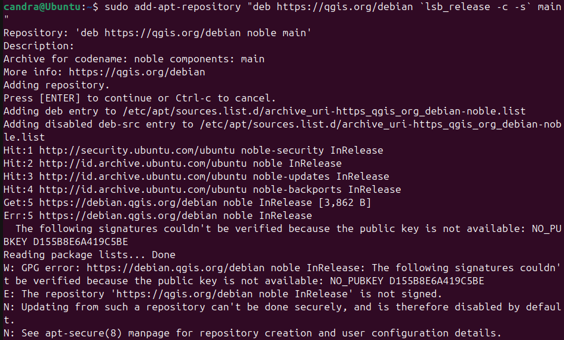
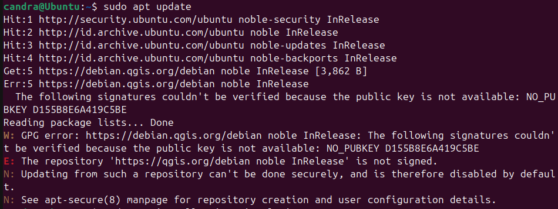
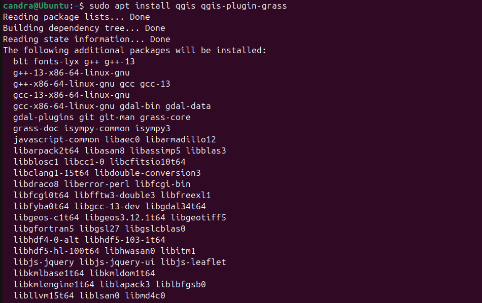
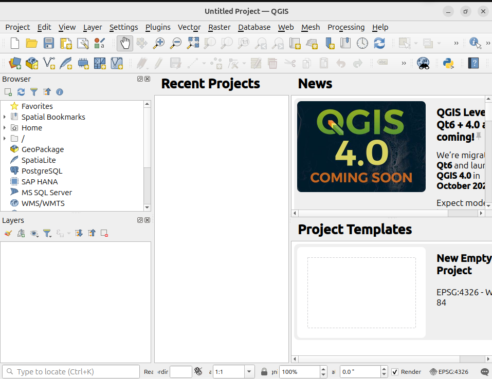

# Panduan Instalasi QGIS di Ubuntu 22.04 LTS

Panduan ini menjelaskan langkah-langkah untuk menginstal QGIS versi stabil terbaru di sistem operasi Ubuntu 22.04 LTS.

---

## 1. Instalasi Tools yang Dibutuhkan

```bash
sudo apt install gnupg software-properties-common
```



---

## 2. Tambahkan GPG Key QGIS

```bash
wget -qO - https://qgis.org/downloads/qgis-2020.gpg.key | sudo gpg --no-default-keyring --keyring gnupg-ring:/etc/apt/trusted.gpg.d/qgis-archive.gpg --import

sudo chmod a+r /etc/apt/trusted.gpg.d/qgis-archive.gpg
```



---

## 3. Tambahkan Repository QGIS

Perintah berikut akan menambahkan repository QGIS sesuai dengan versi Ubuntu kamu:

```bash
sudo add-apt-repository "deb https://qgis.org/debian `lsb_release -c -s` main"
```



---

## 4. Update Repository

```bash
sudo apt update
```



---

## 5. Instalasi QGIS

```bash
sudo apt install qgis qgis-plugin-grass
```

> Jika kamu juga ingin menginstal QGIS Server, tambahkan `qgis-server`:

```bash
sudo apt install qgis qgis-plugin-grass qgis-server
```



---

## 6. Menjalankan QGIS

Tulis perintah berikut di terminal untuk menjalankan QGIS:

```bash
qgis
```


---



---

## 📌 Catatan

- Pastikan koneksi internet stabil selama proses instalasi.
- Jalankan sebagai user biasa, bukan root.
- Tutorial ini mengasumsikan kamu sudah familiar dengan penggunaan terminal di Ubuntu.

---

## 📷 Sumber Gambar

Semua gambar langkah-langkah diambil langsung dari proses instalasi pada sistem Ubuntu 22.04.

---

## 📁 File Asli

Kamu juga bisa mengunduh file panduan asli dalam format Word di sini:
📄 [`Panduan install Qgis di ubuntu 24.docx`](https://github.com/Candrapinem/Install-Software-IDE/blob/main/Panduan%20install%20Qgis.docx)

📄 [`Panduan install Qgis di ubuntu 24.docx`](./Panduan%20install%20Qgis%20di%20ubuntu%2024.docx)
