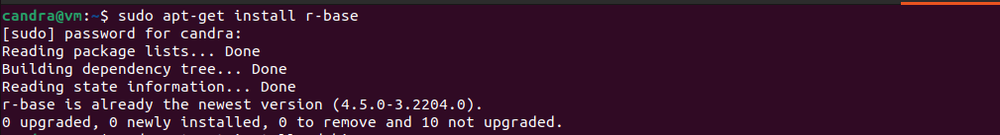
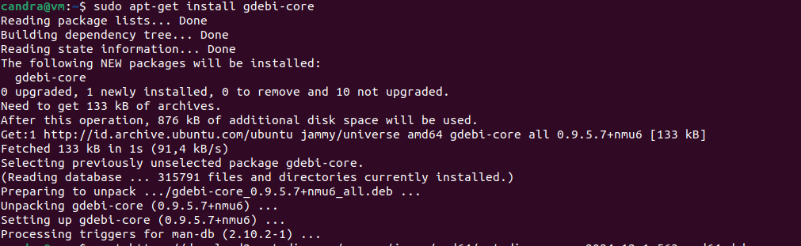
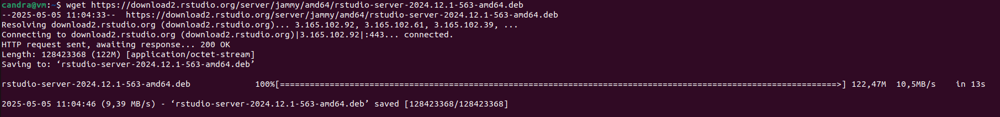
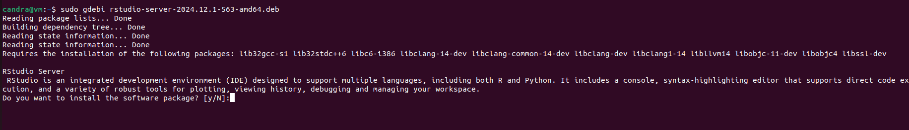
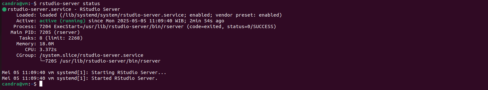

# 📊 Panduan Install RStudio Server di Ubuntu 24.04 LTS

Panduan ini menjelaskan cara menginstal R dan RStudio Server di Ubuntu 24.04.

---

## 📦 1. Install R

Pertama, instal R terlebih dahulu:
```bash
sudo apt-get install r-base
```




## 🔧 2. Install RStudio Server

### a. Install gdebi (alat untuk menginstal file .deb)
```bash
sudo apt-get install gdebi-core
```



### b. Unduh file installer RStudio Server
```bash
wget https://download2.rstudio.org/server/jammy/amd64/rstudio-server-2024.12.1-563-amd64.deb
```


### c. Instal file RStudio Server
```bash
sudo gdebi rstudio-server-2024.12.1-563-amd64.deb
```



---

## 🔗 Referensi

Sumber resmi:  
https://posit.co/download/rstudio-server/
