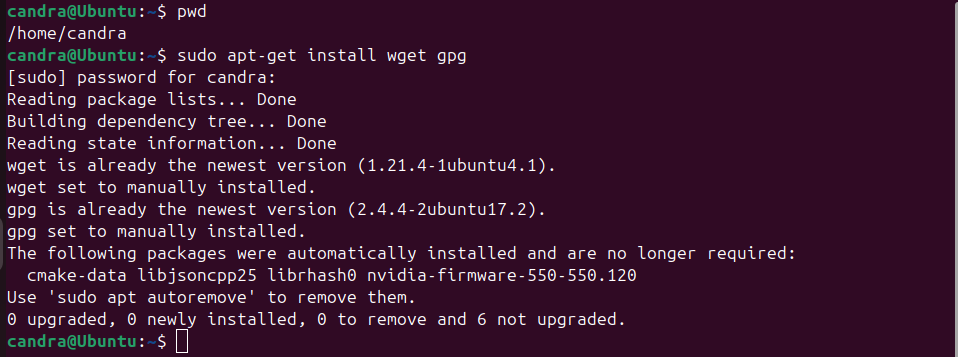
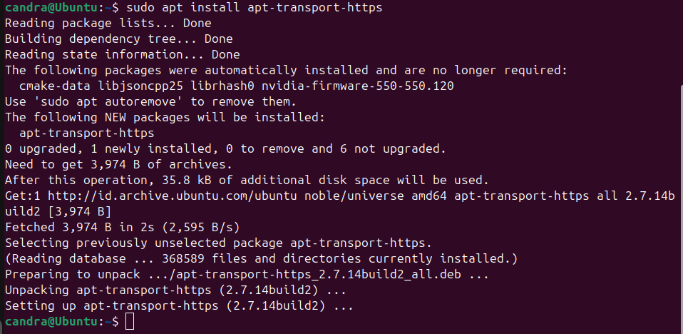
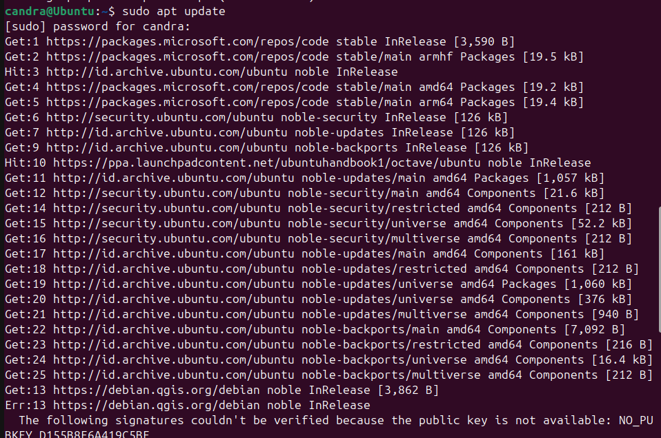
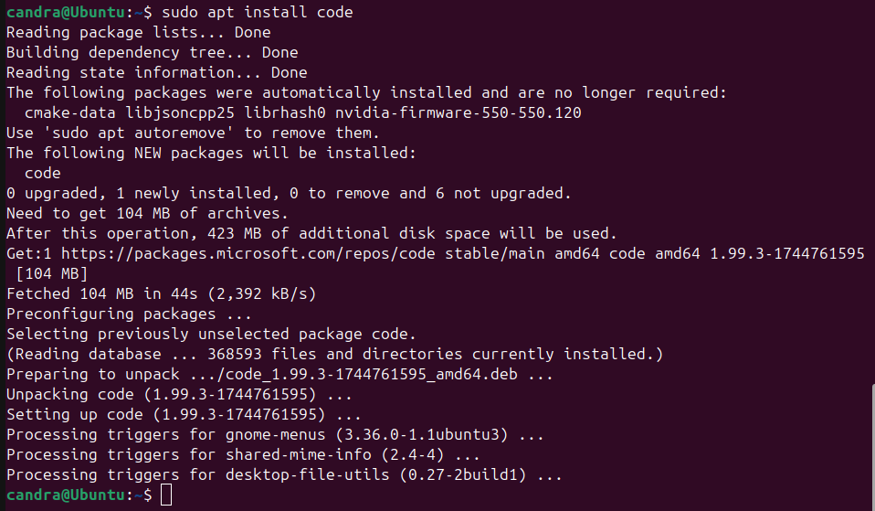
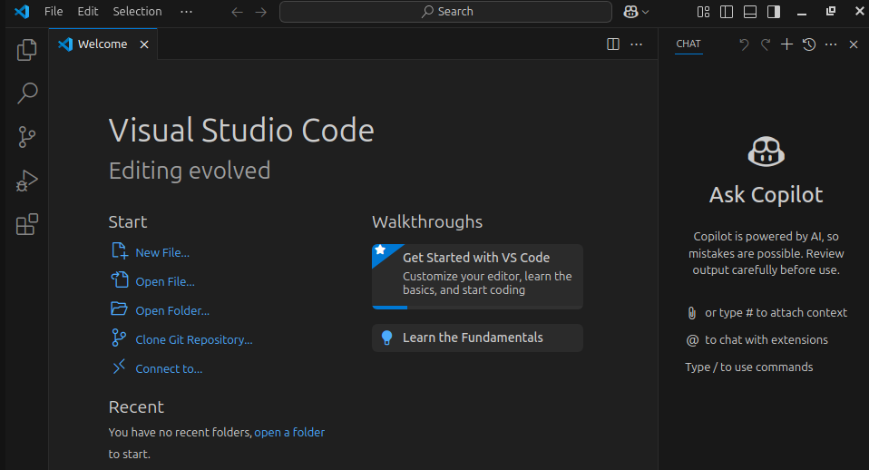

# 🧩 Panduan Install Visual Studio Code di Ubuntu 24.04 LTS

Panduan ini menjelaskan cara menginstal Visual Studio Code (VS Code) di Ubuntu 24.04 menggunakan file `.deb` dari repository resmi Microsoft.

---

## 🔧 1. Install Wget dan GPG

Pastikan `wget` dan `gpg` sudah terinstal:
```bash
sudo apt-get install wget gpg
```


---

## 🔑 2. Tambahkan Repository Microsoft

Import key GPG Microsoft dan tambahkan repo VS Code ke sistem:
```bash
wget -qO- https://packages.microsoft.com/keys/microsoft.asc | gpg --dearmor > packages.microsoft.gpg

sudo install -D -o root -g root -m 644 packages.microsoft.gpg /etc/apt/keyrings/packages.microsoft.gpg

echo "deb [arch=amd64,arm64,armhf signed-by=/etc/apt/keyrings/packages.microsoft.gpg] https://packages.microsoft.com/repos/code stable main" | sudo tee /etc/apt/sources.list.d/vscode.list > /dev/null

rm -f packages.microsoft.gpg
```


---

## 🔄 3. Update dan Install VS Code

Update cache dan install paket VS Code:
```bash
sudo apt install apt-transport-https
```

```bash
sudo apt update
```

```bash
sudo apt install code
```



---

## 🔗 Sumber Resmi

https://code.visualstudio.com/docs/setup/linux
